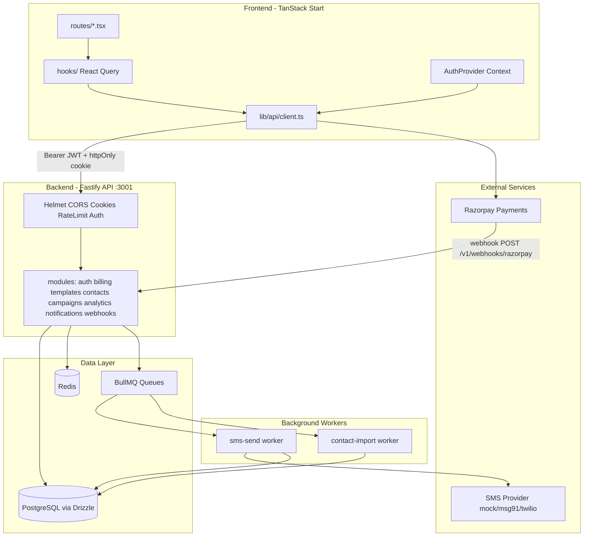
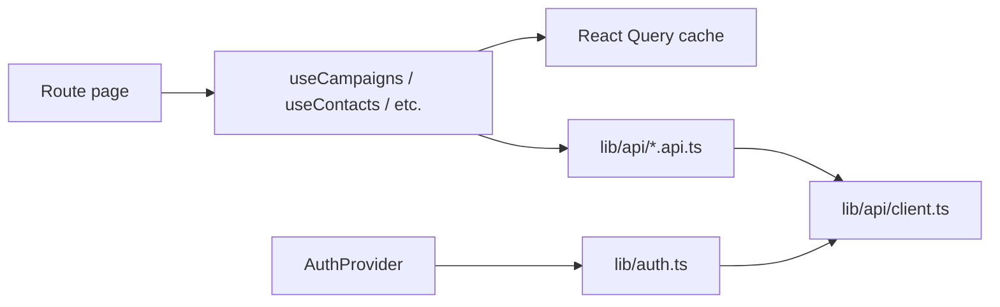
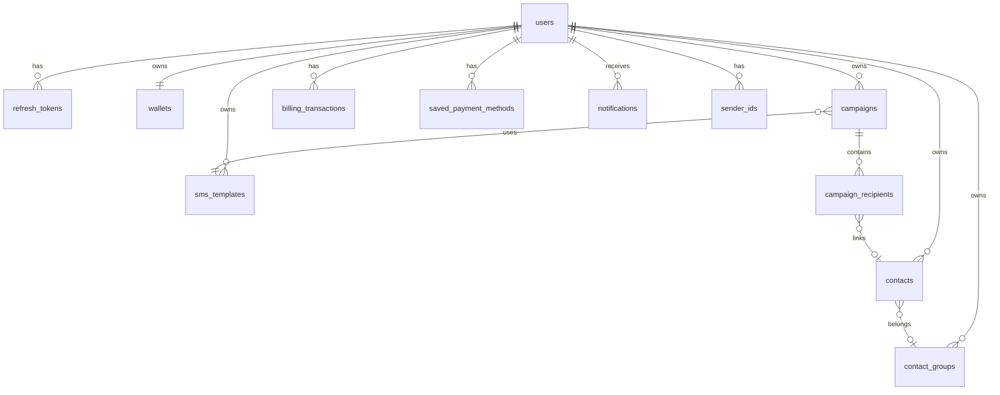
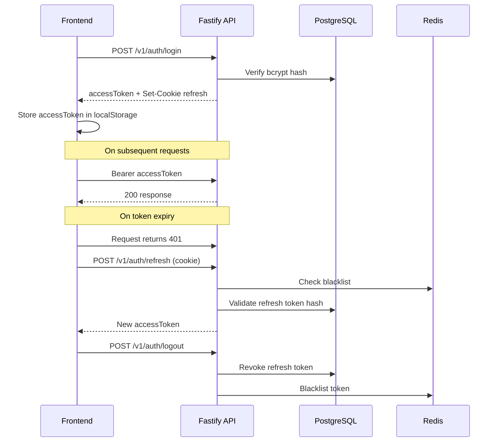
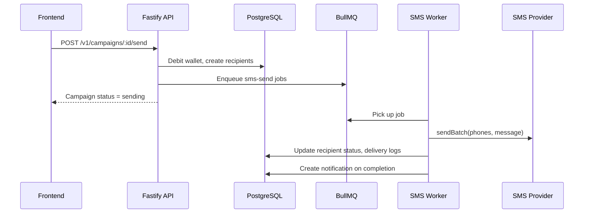

# Pulse SMS — Project Architecture

## Project Overview

**Pulse SMS** (repo: [Bulk SMS Campaign](README.md)) is a bulk SMS campaign management platform. Users can manage contacts, create SMS templates, run campaigns, view analytics, and top up a prepaid wallet via Razorpay.

The repo is a **monorepo with two packages**:

| Package | Path | Role | Dev Port |
|---------|------|------|----------|
| Frontend | [`/src`](src/) (root [`package.json`](package.json)) | Dashboard UI | **8080** |
| Backend API | [`/backend`](backend/) ([`backend/package.json`](backend/package.json)) | REST API + workers | **3001** |

Run both together: `npm start` (uses `concurrently`).

---

## High-Level System Architecture



---

## Frontend Architecture

### Tech Stack

- **React 19** + **TanStack Start** (SSR) + **TanStack Router** (file-based routing)
- **Vite 7** build, **Tailwind CSS 4**, **shadcn/ui** (Radix primitives)
- **TanStack React Query v5** for server state
- **react-hook-form + zod** for forms
- **Recharts** for charts, **Framer Motion** for animations

### Folder Layout

```
src/
├── routes/              # Pages (file-based routing)
│   ├── login.tsx, register.tsx
│   └── _authenticated/  # Protected dashboard pages
├── components/
│   ├── ui/              # shadcn primitives (~40 components)
│   ├── dashboard/       # Layout, sidebar, KPI cards, tables, charts
│   ├── auth/            # Login/register shell
│   ├── billing/         # Wallet, top-up, transactions
│   ├── analytics/       # Analytics charts and tables
│   └── sms-templates/   # Template CRUD UI
├── hooks/               # React Query hooks per domain
├── lib/
│   ├── api/             # REST client + domain API modules
│   ├── auth.ts          # Route guards, session helpers
│   └── razorpay-checkout.ts
├── types/               # Domain TypeScript types
└── integrations/        # Supabase/Lovable OAuth scaffold (secondary)
```

### Routing & Pages

| URL | Route File | Purpose |
|-----|------------|---------|
| `/login` | [`src/routes/login.tsx`](src/routes/login.tsx) | Sign in |
| `/register` | [`src/routes/register.tsx`](src/routes/register.tsx) | Sign up |
| `/` | [`src/routes/_authenticated/index.tsx`](src/routes/_authenticated/index.tsx) | Dashboard overview |
| `/campaigns` | [`src/routes/_authenticated/campaigns.tsx`](src/routes/_authenticated/campaigns.tsx) | Campaign list |
| `/contacts` | [`src/routes/_authenticated/contacts.tsx`](src/routes/_authenticated/contacts.tsx) | Contact management |
| `/sms-templates` | [`src/routes/_authenticated/sms-templates.tsx`](src/routes/_authenticated/sms-templates.tsx) | Template CRUD |
| `/analytics` | [`src/routes/_authenticated/analytics.tsx`](src/routes/_authenticated/analytics.tsx) | Analytics |
| `/billing` | [`src/routes/_authenticated/billing.tsx`](src/routes/_authenticated/billing.tsx) | Wallet & payments |

**Route protection:** [`src/routes/_authenticated.tsx`](src/routes/_authenticated.tsx) calls `requireAuth()` in `beforeLoad` — unauthenticated users redirect to `/login`.

### State Management Pattern



- **No Redux/Zustand** — async data lives in React Query; auth in React Context ([`src/hooks/use-auth.tsx`](src/hooks/use-auth.tsx))
- **Thin routes, fat components** — routes wire layout + hooks; UI logic in `components/`

### API Client ([`src/lib/api/client.ts`](src/lib/api/client.ts))

- Base URL: `VITE_API_BASE_URL` (default `http://localhost:3001/v1`)
- Access token in `localStorage` key `pulse_access_token`
- Sends `Authorization: Bearer <token>` + `credentials: "include"` for refresh cookie
- On **401**: auto-retries via `POST /auth/refresh`, then clears token on failure

### Frontend API Modules → Backend

| Frontend Module | Backend Prefix |
|-----------------|----------------|
| [`auth.api.ts`](src/lib/api/auth.api.ts) | `/v1/auth`, `/v1/users` |
| [`campaigns.api.ts`](src/lib/api/campaigns.api.ts) | `/v1/campaigns` |
| [`contacts.api.ts`](src/lib/api/contacts.api.ts) | `/v1/contacts` |
| [`templates.api.ts`](src/lib/api/templates.api.ts) | `/v1/templates` |
| [`analytics.api.ts`](src/lib/api/analytics.api.ts) | `/v1/analytics`, `/v1/notifications` |
| [`billing.api.ts`](src/lib/api/billing.api.ts) | `/v1/billing` |

---

## Backend Architecture

### Tech Stack

- **Node.js** (ES modules) + **TypeScript** → compiled to `dist/`
- **Fastify 5** HTTP framework with plugins: CORS, Helmet, cookies, rate-limit, Swagger
- **PostgreSQL** via `pg` pool + **Drizzle ORM**
- **Redis** (`ioredis`) for token blacklist and analytics cache
- **BullMQ** for async jobs (`sms-send`, `contact-import`)
- **JWT + bcrypt** auth; **Razorpay** for payments; pluggable **SMS providers**

### Modular Monolith Pattern

Each domain module has `*.routes.ts` (HTTP) + `*.service.ts` (business logic):

```
backend/src/
├── index.ts              # Entry: listen on PORT (default 3001)
├── app.ts                # Fastify setup, route registration, error handler
├── config/env.ts         # Zod-validated environment
├── plugins/
│   ├── auth.plugin.ts    # JWT Bearer decorator (fastify.authenticate)
│   └── rate-limit-auth.plugin.ts  # 5 req/min on auth routes
├── db/
│   ├── schema/           # Drizzle table definitions
│   ├── migrations/       # SQL migrations
│   └── client.ts         # Drizzle + pg pool
├── modules/
│   ├── auth/             # Register, login, refresh, logout
│   ├── billing/          # Wallet, Razorpay orders/verify
│   ├── templates/        # SMS template CRUD
│   ├── contacts/         # Contact CRUD, bulk ops, CSV import/export
│   ├── campaigns/        # Campaign create/send/cancel
│   ├── analytics/        # KPIs, timeseries, channel stats
│   ├── notifications/    # In-app notifications
│   └── webhooks/         # SMS delivery + Razorpay webhooks
├── integrations/sms/     # mock, msg91, twilio adapters
├── shared/               # errors, redis, queue, pricing, audit, pagination
└── workers/index.ts      # BullMQ processors (separate process)
```

Route registration in [`backend/src/app.ts`](backend/src/app.ts):

```46:54:backend/src/app.ts
  await app.register(authRoutes, { prefix: "/v1/auth" });
  await app.register(userRoutes, { prefix: "/v1/users" });
  await app.register(billingRoutes, { prefix: "/v1/billing" });
  await app.register(templateRoutes, { prefix: "/v1/templates" });
  await app.register(contactRoutes, { prefix: "/v1/contacts" });
  await app.register(campaignRoutes, { prefix: "/v1/campaigns" });
  await app.register(analyticsRoutes, { prefix: "/v1/analytics" });
  await app.register(notificationRoutes, { prefix: "/v1/notifications" });
  await app.register(webhookRoutes, { prefix: "/v1/webhooks" });
```

### API Surface Summary

**Public (no auth):**
- `POST /v1/auth/register`, `/login`, `/refresh`, `/forgot-password`, `/reset-password`
- `POST /v1/webhooks/sms/delivery`, `/razorpay`
- `GET /health`, `GET /docs`

**Authenticated (`Authorization: Bearer`):**
- Users: `GET/PATCH /v1/users/me`, `POST /v1/users/me/avatar-upload-url`
- Billing: wallet, transactions, usage, orders, verify
- Templates, Contacts, Campaigns: full CRUD + bulk/send actions
- Analytics: overview, timeseries, channels, campaigns, contacts
- Notifications: list, mark read

**Rate limits:** 100 req/min global; 5 req/min on auth routes.

---

## Database Schema

PostgreSQL tables (Drizzle schema in [`backend/src/db/schema/`](backend/src/db/schema/)):



**Key enums:** `contact_status`, `campaign_status`, `recipient_status`, `template_type`, `billing_transaction_type`

**Cascade deletes:** All user-owned data deletes when user is removed.

---

## Core Data Flows

### 1. Authentication Flow



### 2. Campaign Send Flow



### 3. Razorpay Top-Up Flow

1. Frontend calls `POST /v1/billing/orders` → backend creates Razorpay order
2. Frontend opens Razorpay checkout modal ([`src/lib/razorpay-checkout.ts`](src/lib/razorpay-checkout.ts))
3. On success, frontend calls `POST /v1/billing/verify` with payment signature
4. Backend credits wallet, records transaction
5. Razorpay webhook at `POST /v1/webhooks/razorpay` (signature-verified, credits wallet on `payment.captured`)

---

## Environment Configuration

| Variable | Where | Purpose |
|----------|-------|---------|
| `VITE_API_BASE_URL` | [`.env`](.env) | Frontend → backend URL |
| `VITE_RAZORPAY_KEY_ID` | `.env` | Razorpay checkout (public key) |
| `DATABASE_URL` | [`backend/.env`](backend/.env) | PostgreSQL connection |
| `JWT_ACCESS_SECRET`, `JWT_REFRESH_SECRET` | `backend/.env` | JWT signing (min 32 chars) |
| `REDIS_URL` | `backend/.env` | Redis connection |
| `CORS_ORIGIN` | `backend/.env` | Allowed frontend origins |
| `SMS_PROVIDER` | `backend/.env` | `mock` / `msg91` / `twilio` |
| `RAZORPAY_*` | `backend/.env` | Payment gateway secrets |
| `SMTP_*`, `FROM_EMAIL` | `backend/.env` | Password reset emails (logs to console when unset) |
| `S3_*` | `backend/.env` | Avatar presigned upload URLs |
| `APP_FRONTEND_URL` | `backend/.env` | Password reset link base URL |

---

## SMS Provider Integration

Factory pattern in [`backend/src/integrations/sms/`](backend/src/integrations/sms/):

- **mock** (default) — logs messages, no real send
- **msg91** — Indian SMS gateway
- **twilio** — international SMS

Interface: `sendSms()`, `sendBatch()` via [`sms.provider.ts`](backend/src/integrations/sms/sms.provider.ts)

---

## Implemented Integrations

- **Password reset** — token stored in `password_reset_tokens`; email sent via SMTP (or logged in dev)
- **Background workers** — `startWorkers()` runs on `npm run dev:worker`
- **Webhooks** — SMS delivery updates recipient/campaign stats; Razorpay credits wallet
- **S3** — `POST /v1/users/me/avatar-upload-url` returns presigned upload URL
- **SMTP** — [`backend/src/shared/email.ts`](backend/src/shared/email.ts) via nodemailer

## Remaining Notes

- **Supabase OAuth** — wired in [`src/integrations/supabase/`](src/integrations/supabase/) but primary auth is backend JWT; OAuth is secondary/scaffold

---

## Local Development

```bash
npm install
npm run setup:local    # first time: DB + migrations
npm start              # frontend :8080 + backend :3001
```

Separate processes:
- Frontend only: `npm run dev:frontend`
- Backend only: `npm run dev:backend`
- Workers: `npm run dev:worker --prefix backend`
- DB studio: `npm run db:studio --prefix backend`

---

## Architecture Strengths

- **Clear separation**: frontend and backend are independent packages with typed API contracts
- **Modular backend**: each domain is self-contained (routes + service)
- **Pluggable SMS**: provider adapter pattern supports multiple gateways
- **Async campaign sending**: BullMQ decouples send from HTTP request
- **Wallet-based billing**: prepaid model with Razorpay integration
- **Consistent frontend pattern**: React Query hooks per domain, centralized API client with auto-refresh
